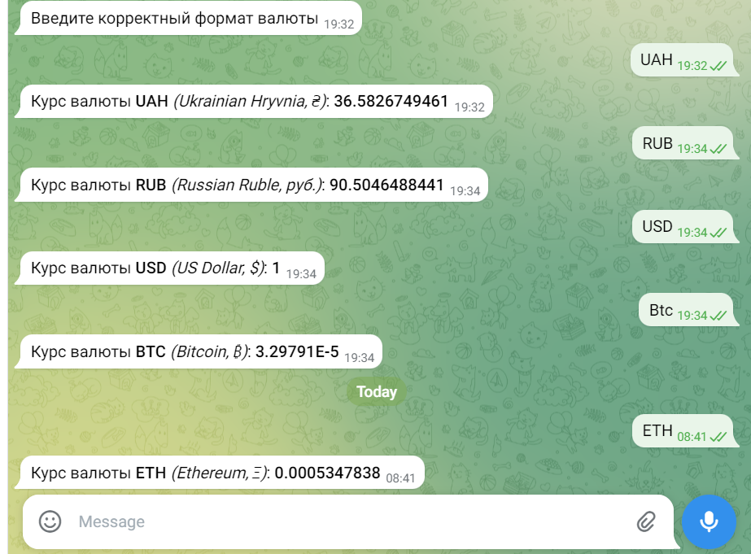

## Currency Bot

Это бот, который может подсказать стоимость любой валюты относительно американского доллара (даже криптовалюты, например, BTC).

Указывать желаемую валюту необходимо в международном стандарте: - ISO4217 standart. 
Примеры: USD, EUR, RUB, UAH, BTC.

Я использовала:
* php 7.4, 
* TelegramBotApi
* https://api.currencyapi.com/v3 : "https://api.currencyapi.com/v3/latest?apikey=$currencyToken&currencies="

Бота можно потыкать
[здесь](https://web.telegram.org/k/#@RelevantCurrenciesBot)
или найти в телеграмме: @RelevantCurrenciesBot

